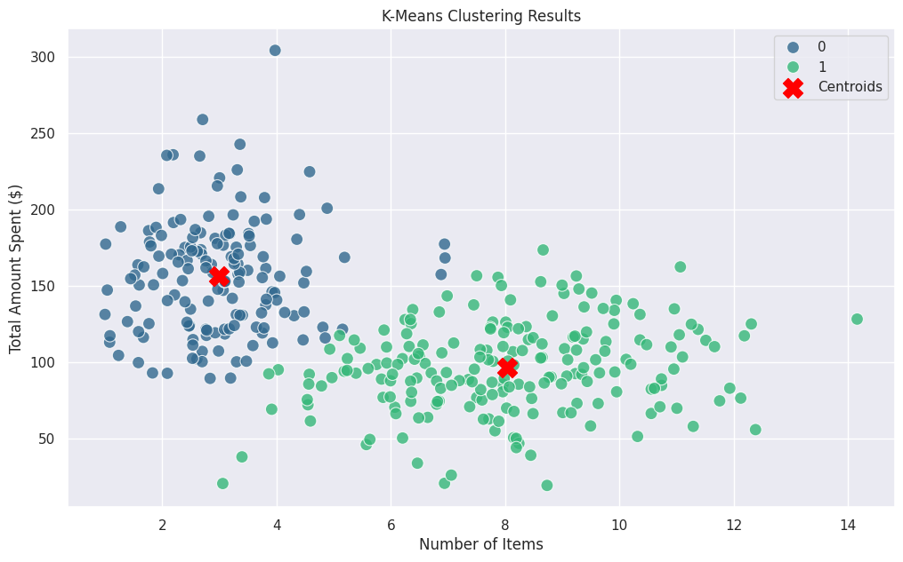

# README – Customer Basket Clustering

## Title

**Clustering Customer Baskets with K-Means, Agglomerative, and DBSCAN**

## Objective

Apply and compare three clustering methods on shopping basket data (`item_count`, `total_spent`), and interpret results using the Elbow method and inertia for K-Means.

## Data & Preprocessing

- Input: `clustering.csv`  
- Features: `item_count`, `total_spent`  
- Standardized with **StandardScaler** to avoid scale bias in distance-based clustering.

## Methods

1. **K-Means (k=2)**  
   - Parameters: `random_state=42`, `n_init=10`  
   - Centroids computed and inverse-transformed into original units.  

2. **Elbow Method**  
   - WCSS (inertia) computed for k=1 to k=10.  
   - Knee point used to justify the optimal cluster number.  

3. **Agglomerative Clustering (Ward, k=2)**  
   - Variance-minimizing hierarchical approach.  

4. **DBSCAN (eps=0.15, min_samples=5)**  
   - Density-based clustering with noise detection (-1 label).  

5. **Visualization**  
   - Scatterplots showing each method’s partitioning.  

## Inertia (K-Means)

- **Definition**: Inertia is the **within-cluster sum of squared distances (WCSS)**, measuring how tightly data points are grouped around centroids.  
- **Interpretation**: Lower inertia = more compact clusters.  
- **Behavior**: Inertia always decreases as k increases.  
- **Use**: Applied in the **Elbow method** to balance cluster compactness and model simplicity.  
- **Limitation**: Best suited for spherical clusters; not reliable for irregular shapes or varying densities.  

---

## Results

### Figure 1: Elbow Method (WCSS vs k)

**Interpretation**:  
- Large drop between k=1 and k=2, then slope flattens.  
- Justifies k=2 as the optimal number of clusters.  

---

### Figure 2: K-Means Clustering (k=2)

**Interpretation**:  
- Two distinct clusters of baskets:  
  - Cluster 0: fewer items, higher spending.  
  - Cluster 1: more items, lower spending.  
- Red crosses = centroids in original units.  

---

### Figure 3: Comparative Methods (K-Means vs Agglomerative vs DBSCAN)

**Interpretation**:  
- **K-Means (k=2)**: compact, spherical clusters.  
- **Agglomerative (k=2)**: produces a similar split, sensitive to hierarchical structure.  
- **DBSCAN**: identifies dense regions and labels noise; flexible for non-spherical shapes.  

---

## Reproducibility

- Fixed seeds (`random_state=42`).  
- Dependencies: numpy, pandas, matplotlib, seaborn, scikit-learn, google.colab.  

---
